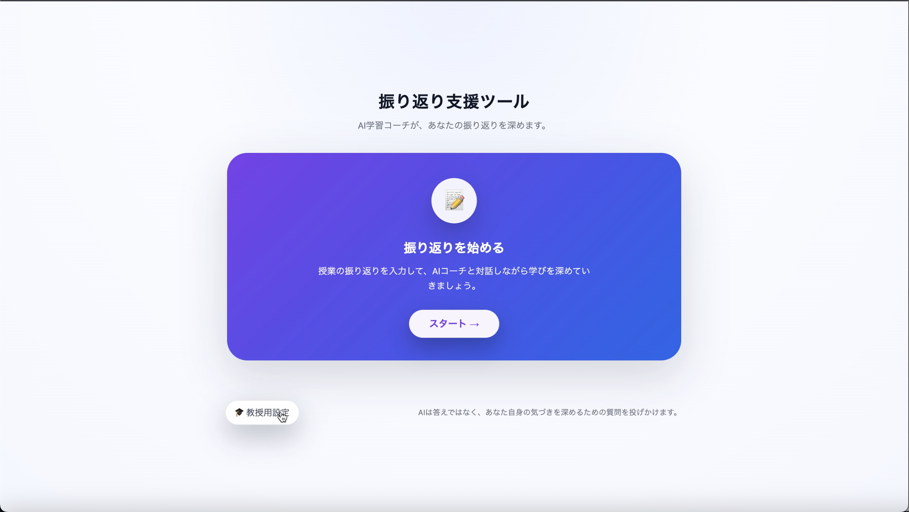
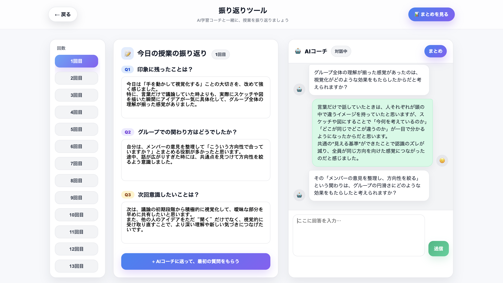
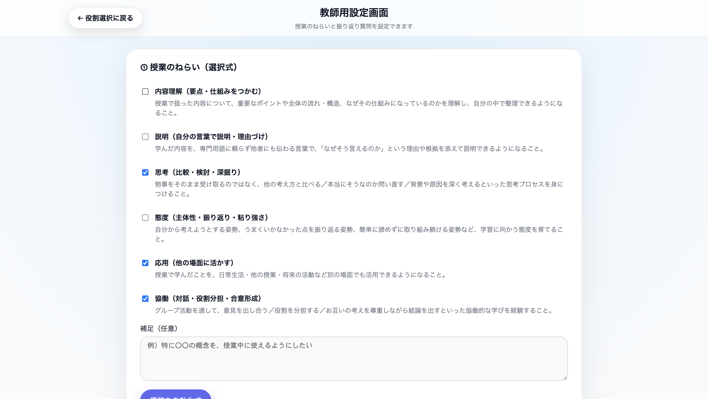
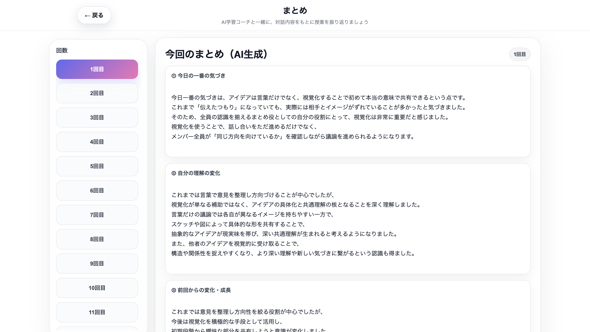

# AIコーチング振り返り支援ツール

AIとの対話を通じて授業の振り返りを支援するWebアプリです。

学生は授業後の振り返りを入力し、AIコーチからの質問に答えながら学びを深掘りできます。
また、教師は授業のねらいに応じた振り返り項目や深掘り対話を行う回を設定できます。

---

## スクリーンショット

### ホーム画面

### 学生用画面

### 教師用設定画面

### まとめ画面

---

## 概要

本システムは、授業後の振り返り活動を支援することを目的として制作しました。

学生は振り返り内容を入力し、AIコーチとの対話を通して自身の学びを整理します。
教師は授業のねらいに応じた質問項目や深掘り対話を行う回を設定でき、授業設計に合わせた振り返り支援が可能です。

---

## 主な機能

### 学生用機能

- 授業選択
- 振り返り入力
- AIコーチとの対話
- 深掘り質問機能
- AIによる振り返り要約
- 回ごとの振り返り管理

### 教師用機能

- 授業のねらい設定
- 振り返り質問の自動生成
- 質問内容の編集
- 深掘り対話を行う回の設定
- 設定内容の保存

---

## 使用技術

- HTML
- CSS
- JavaScript
- Gemini API
- LocalStorage

---

## システム構成

- index.html（ホーム画面）
- class-select.html（授業選択画面）
- student.html（学生用画面）
- teacher.html（教師用設定画面）
- summary.html（振り返りまとめ画面）

---

## 制作背景

大学の卒業研究として制作しました。

授業内の振り返りでは、学習内容を十分に言語化できない学生や、振り返りの質にばらつきが生じる課題があります。

そこで、AIを活用して学生の思考を促進し、学びの整理やメタ認知を支援する振り返りツールを開発しました。

---

## 担当範囲

- 企画・要件定義
- UI/UX設計
- HTML / CSS実装
- JavaScript実装
- Gemini API連携
- 振り返り支援フロー設計
- プロンプト設計

---

## 注意事項

本リポジトリでは、画面構成やUIを確認できるHTMLファイルのみ公開しています。
AI連携を含むサーバー側の実装およびAPIキーは公開していません。