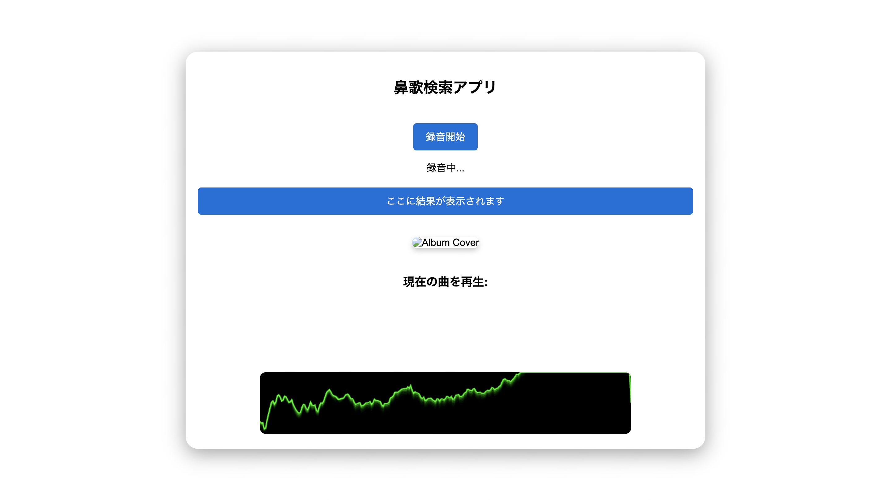
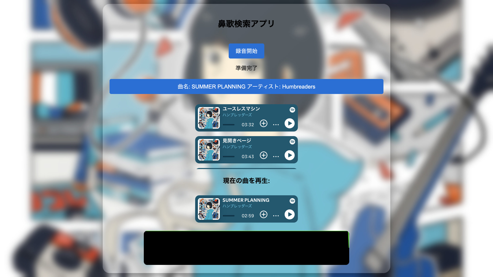

# 楽曲検索ツール

音声から楽曲を検索できるWebアプリです。

## スクリーンショット

## 概要

録音した音声をAudD APIで解析し、楽曲名とアーティスト名を取得します。  
取得した情報をもとにSpotify APIで楽曲を検索し、Spotifyプレイヤーやアルバム情報を表示します。

## 使用技術

- HTML
- CSS
- JavaScript
- AudD API
- Spotify Web API

## 主な機能

- 音声録音
- 楽曲検索
- 検索結果の表示
- Spotifyプレイヤーの表示
- アルバム収録曲の表示
- アルバム画像を背景に反映
- 音声ビジュアライザー表示

## 制作背景

曲名が分からない楽曲を、音声から簡単に探せるようにしたいと考え制作しました。

## 担当範囲

- UI設計
- HTML / CSS 実装
- JavaScript 実装
- AudD API連携
- Spotify API連携
- 音声ビジュアライザー実装

## 注意事項

APIキーはセキュリティ上の理由から削除しています。  